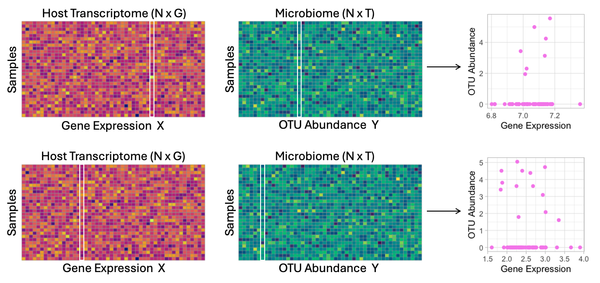

# MITScan: Score-Based Genome-Wide Association Analysis of the Microbiome and Host Transcriptome



## Overview

Imbalances in microbial composition, potentially regulated by host gene expression, have been associated with various diseases.
MITScan performs score-based genome-wide association analysis of the microbiome and host transcriptome using zero-inflated negative binomial models to uncover the mechanisms underlying human health and disease. 

## Installation

```R
install.packages("devtools")
devtools::install_github("yajing-hao/MITScan")
```

## Vignettes

For illustration, we load paired microbiome and host transcriptome data from the inflammatory bowel disease multi-omics data (IBDMDB), consisting of 64 subjects, 183 OTUs, and 500 host genes.

```R
library(MITScan)
OTU = IBD_OTU
hostgene = IBD_hostgene
cvrt = IBD_cvrt
```

We conduct score-based genome-wide association analysis across all OTU abundances and host genes using zero-inflated negative binomial models.

```R
zinb1 = MITScan_ZINB(Ymat=OTU, X=cvrt, Z=NULL, A=hostgene, perm=2, no_cores=8, seed=1)
```

The ($i,j$) element of the returned matrix represents the score test statistic for the $i$-th host gene and the $j$-th OTU abundance. The last row contains the median of permuted score test statistics for each gene.

## Author
Yajing Hao, Fei Zou

## Maintainer
Yajing Hao <yajingh@live.unc.edu>
